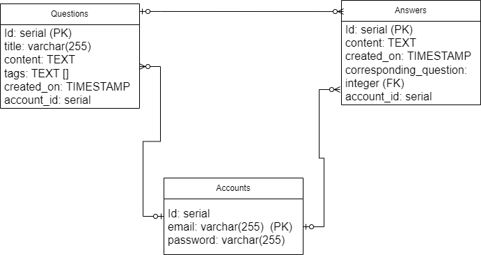
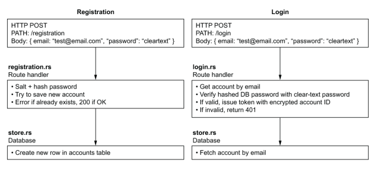
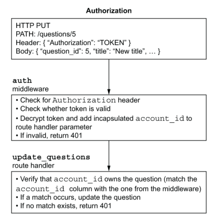
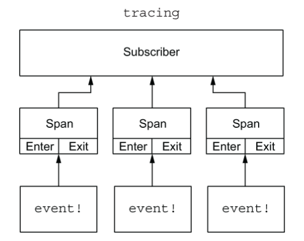

# Q&A Backend Web Server Documentation

## 1. Introduction

This project serves as a backend server for a question and answer website where users can register accounts, post questions, and answer other users' questions.\
This project was written in Rust language, using Warp framework.
## 2.  Getting Started

### Prerequisites

- Rust and Cargo installed
- Implemented on Linux and Docker
- PostgreSQL database

### Installation

You should read the guide on [README.md](../../../README.md).

## 3. Database

I used PostgreSQL database. Here is the schema:



I also utilized the [Migration](https://www.cloudbees.com/blog/database-migration) technique, which aids in controlling the version of the database and also serves as documentation for database changes.

## 4. API Documentation

There are 3 main types of API
### Authentication

 
##### 1. **`POST /register:` Register a new account:**

Send a **POST** request to `/registration`, with the body format is `json`, including email and password:

```
{
  "email": "vanhg@gmail.com",
  "password": "1"
}
```
If it's successful, the response is: `Account added` . Otherwise, the response is: `Cannot update data`


##### 2. **`POST login`: Log in to an account**

Send a **POST** request to `/login`, with the body format is `json`, including your email and password:

```
{
    "email": "vanhg@gmail.com",
    "password": "1"
}
```
If it's successful, the response is your Auth token. Otherwise, the response is `Unauthorized`

### Questions

##### 1.  **`POST /questions`: Create a new question**

Send a **POST** request to `/questions`, with authenticate token in headers and the body format is `json`, including title, content and tags:
```
{

    "title":"Datg",

    "tags": ["pad"],

    "content":"Neymar"

}
```
If it's successful, the response is your question with it's **id** in database.


##### 2. **`GET /questions`: Get a list of questions.**

Send a **GET** request to `/questions`, with 2 optional parameters `offset` and `limit`.
```
localhost:3000/questions?limit=2&offset=0
```
Where:
- `limit`: the maximum number of questions in the response.
- `offset`: indicates the starting position in the database from which to retrieve the questions.
If it's successful, the response is a list of questions.


##### 3. **`PUT /questions/{id}`: Edit a question.**

Send a **PUT** request to `/questions`, with a query is the **question id**.
```
localhost:3000/questions/1
```
The body is in the JSON format:
```
{

    "title": "NEW vjp TITLE",

    "content": "OLD CONTENT"

}
```
If it's successful, the response is an updated question.


##### 4. **`DELETE /questions/{id}`: Delete a question.**
Send a **DELETE** request to `/questions`, with a query is the **question id**.
```
localhost:3000/questions/1
```
If it's successful, the response is `Deleted successfully`.


### Answers

##### 1. **`POST /answers`: Answer a question.**

Send a **POST** request to `/answers`, with authenticate token in headers and the body format is `form-urlencoded`, including content and question_id:
```
content: mck
question_id: 1
```
If it's successful, the response is `Answer Added`.


##### 2. **`GET /answers`: Get answers to a question.**

Send a **GET** request to `/answers`, with 2 optional parameters `offset` and `limit` and a obligatory parameter `question_id`
```
localhost:3000/answers?limit=2&offset=0&question_id=1
```
Where:
- `limit`: the maximum number of questions in the response.
- `offset`: indicates the starting position in the database from which to retrieve the questions.
- `question_id`: the id of the question.
If it's successful, the response is a list of answers.


## 5. Authentication and Authorization

This is the authentication flow:



Here, for hashing password, I used: `rust-argon2`, which is a hashing algorithm. 
Moreover, I also added an expiry date to tokens. 

This is the authorization flow:


For encryption and decryption purposes, this project used [PASETO](https://paseto.io), which is a stateless token algorithm. This means it can independently validate tokens without requiring storage or querying from external sources.

## 6. Error Handling

This project also included many custom types of Error. Please run:
```
cargo doc --open
```
in the handle-errors folder for fully description about each error.

## 7. Testing

Unit test are available in each module. Run tests with this command:
```
cargo test
```

Beside that, in the folder Testing, there is a video about how I tested the APIs via Postman. You should watch it. 

## 8. Debugging and Tracing

This projects utilizes Tracing crate, which offers a way to follow a request from start to finish, with us being able to put an ID onto the request and follow it through each stage of the process. This allows us to see more detail around an error.

This is the tracing flow:

There, ***events*** are your logs, which are happening inside spans. An event can be anything you want it to be: the return of results for a database query, the start and end of decrypting a password, or its success or failure,... \
A ***span*** is a period, with a start and an end. Most of the time, the start is the request, and the end is the sending out of the HTTP response.\
Then, to collect all the log in the codebase, we have ***Subscriber***.

There are 3 the levels of logging on the Tracing crate: `info`, `warn`, or `error`. This project allows you to set the log level (in the `.env` files). I suggest using `warn` for the best performance.

## 9. Deployment

Deploy the server in a production environment using Docker or manually.
You can see the configuration on `Dockerfile` and `docker-compose.yml` on the project folder.

## 10. Contributing

Contributions are welcome! Please open an issue or submit a pull request on GitHub.

## 11. Contact Information

For questions or support, contact us at vietanhpg2003@gmail.com.


